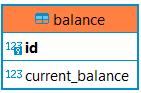

## API для Интернет-банка
**Задача:** реализовать Rest API по работе с банковским счетом.  
**В данном проекте будут реализованы следующие операции:**  
+ Узнать баланс по ID пользователя;
+ Снятие заданной суммы с баланса пользователя;
+ Пополнение баланса на заданную сумму;
+ Отобразить список операций за выбранный период;
+ Перевести заданную сумму другому пользователю.
___
## Этап 1. Работа с балансом ##  
## Шаг 1. Спроектировать базу данных ##  
1. Создала в PostgreSQL базу данных 
2. Создала приложение с помощью *Spring Initializr* со следующей конфигурацией: 
+ Lombok
+ Spring Web
+ Spring Data Jpa
+ PostgreSQL Driver
4. Создан класс сущности Users с полями id,currentBalance, firstName и lastName  
 

                
## Шаг 2. Создать класс по работе с базой данных ##  
1. Создан класс UsersService в котором реализованы методы *getBalance, putMoneу, takeMoney*  
2. Создан файл *application.properties* для хранения настроек  
3. Добавлены в функцию main вызовы методов *getBalance, putMoneу, takeMoney*

## Шаг 3. Создайте Rest API ##
1. Создан интерфейс UsersRepository 
2. Создан класс UsersController  
---
